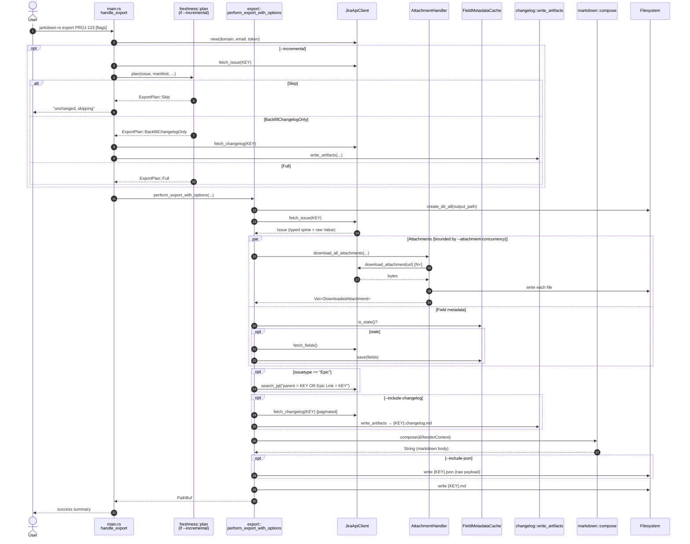
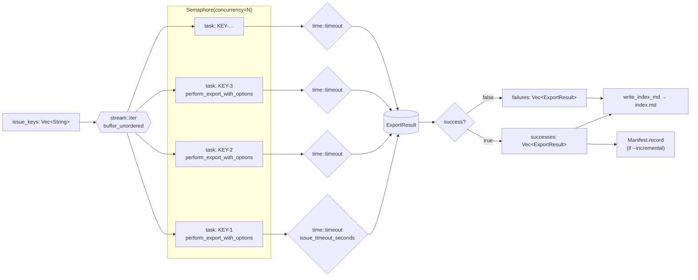
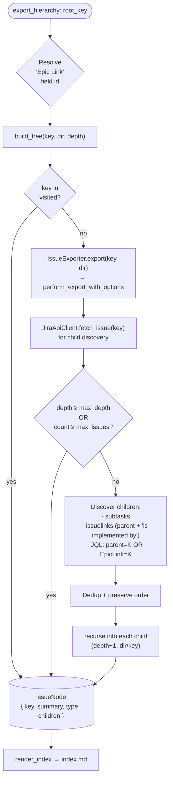
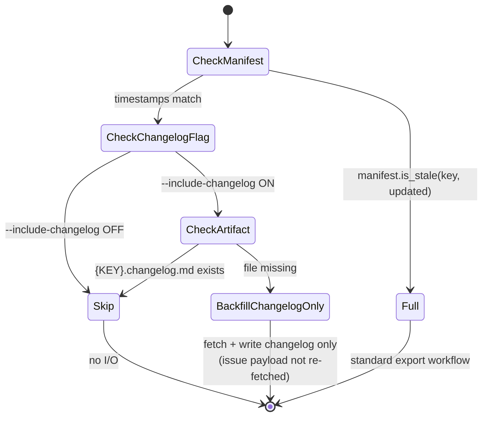
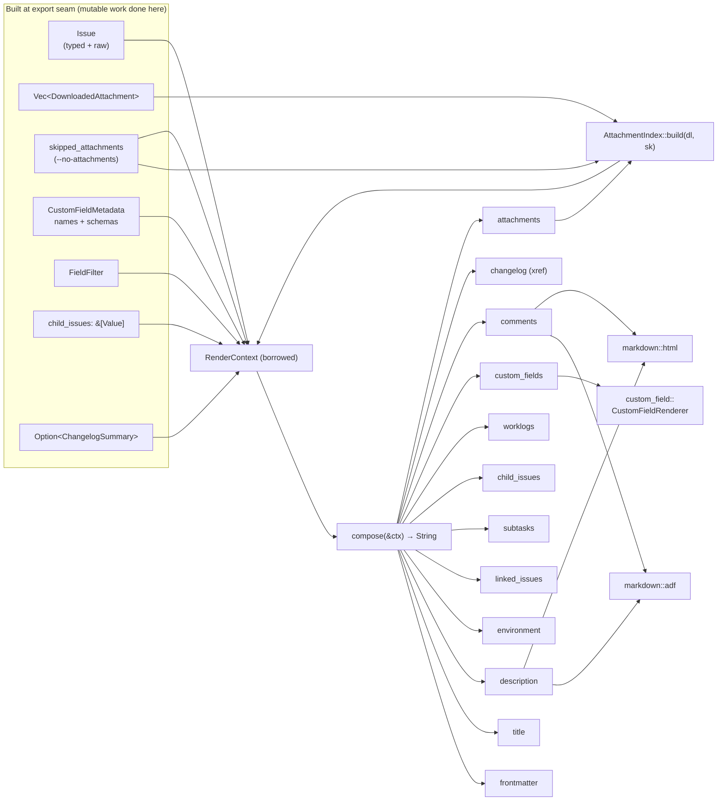
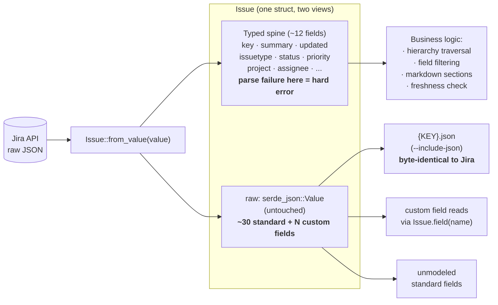
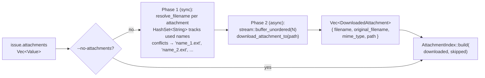

# Architecture

This document describes how jarkdown-rs is layered and how data flows through
the codebase. It complements:

- `CONTEXT.md` — domain glossary (Issue, Changelog, Comment, Worklog).
- `docs/adr/0001-changelog-export.md` — why the changelog is a sibling artifact
  with one-time backfill semantics.
- `docs/adr/0002-typed-issue-model-retains-raw-payload.md` — why `Issue` keeps
  both the typed spine and the raw `Value`.

All diagrams are MermaidJS and render natively on GitHub and most modern
Markdown viewers.

## Overall architecture

Five layers, each depending only on the ones below it. The CLI is a thin shell
over the library; everything reusable lives behind `src/lib.rs`.

```mermaid
flowchart TB
    subgraph entry[Entry surface]
        CLI["CLI bin<br/><code>jarkdown-rs</code><br/>(main.rs · cli.rs)"]
        LIB["Library API<br/>(lib.rs:<br/><code>export_issue</code> · <code>ExportOptions</code>)"]
    end

    subgraph orch[Orchestration]
        EXPORT["<code>export::perform_export_with_options</code><br/>single-issue workflow"]
        BULK["<code>bulk::BulkExporter</code><br/>semaphore-bounded fan-out"]
        HIER["<code>hierarchy::HierarchyExporter</code><br/>recursive tree traversal"]
        EXSEAM["<code>exporter::IssueExporter</code><br/>trait seam"]
    end

    subgraph domain[HTTP &amp; domain]
        CLIENT["<code>jira_client::JiraApiClient</code><br/>REST · auth · pagination"]
        ISSUE["<code>issue::Issue</code><br/>typed + raw payload"]
        CL["<code>changelog::*</code><br/>render + write"]
        RETRY["<code>retry::retry_with_backoff</code>"]
    end

    subgraph render[Rendering · pure]
        COMPOSE["<code>markdown::compose(&amp;RenderContext)</code>"]
        SECTIONS["<code>markdown::sections</code><br/>frontmatter · description · ..."]
        ADF["<code>markdown::adf</code><br/>ADF → MD"]
        HTML["<code>markdown::html</code><br/>HTML → MD"]
        ATTIDX["<code>markdown::attachments::AttachmentIndex</code>"]
        CFR["<code>custom_field::CustomFieldRenderer</code>"]
    end

    subgraph state[Persistence &amp; caches]
        MAN["<code>manifest::Manifest</code><br/>.jarkdown-manifest.json"]
        FRESH["<code>freshness::plan</code><br/>ADR-0001 decision"]
        FCACHE["<code>field_cache::FieldMetadataCache</code><br/>XDG · 24h TTL"]
        CFG["<code>config::ConfigManager</code><br/>.jarkdown.toml"]
        ATT["<code>attachment::AttachmentHandler</code><br/>download + dedupe"]
    end

    JIRA[(Jira Cloud<br/>REST API v3)]
    FS[(Filesystem<br/><code>{KEY}/{KEY}.md</code>)]

    CLI --> LIB
    CLI --> EXPORT
    CLI --> BULK
    CLI --> HIER
    LIB --> EXPORT

    BULK --> EXPORT
    BULK --> FRESH
    BULK --> MAN
    HIER --> EXSEAM
    EXSEAM --> EXPORT

    EXPORT --> CLIENT
    EXPORT --> ATT
    EXPORT --> CL
    EXPORT --> CFG
    EXPORT --> FCACHE
    EXPORT --> COMPOSE
    EXPORT --> FRESH

    CL --> CLIENT
    CLIENT --> RETRY
    CLIENT --> ISSUE
    ATT --> CLIENT

    COMPOSE --> SECTIONS
    SECTIONS --> ADF
    SECTIONS --> HTML
    SECTIONS --> ATTIDX
    SECTIONS --> CFR

    CLIENT -->|HTTPS| JIRA
    EXPORT -->|writes| FS
    CL -->|writes| FS
    ATT -->|writes| FS
```

**Layer rules to preserve:**

- The render layer is *pure* — `markdown::compose` borrows everything via
  `RenderContext`, takes no `&mut`, and performs no I/O. All mutable
  field-cache resolution happens up at the `export` seam.
- `jira_client` is pure transport above the HTTP boundary; typed parsing into
  `Issue` / `ChangelogEntry` / `IssueSearchResult` happens at that seam (see
  ADR-0002).
- `freshness::plan` is the *only* implementation of the incremental decision
  (see ADR-0001). The single-export CLI path and `BulkExporter` both consult it
  instead of re-deriving the rule.

## Single-issue export flow

What happens when you run `jarkdown-rs export PROJ-123`. Same flow is invoked
by the library entry point `export_issue` and by `BulkExporter` per task.



## Bulk concurrency model

`BulkExporter` fans work out across N concurrent issue tasks using a tokio
`Semaphore`. Each task internally runs the same `perform_export_with_options`
workflow shown above, with its own `--attachment-concurrency` budget — so the
effective parallelism is `concurrency × attachment_concurrency`.



Per-task incremental short-circuit lives at the top of each task and consults
`freshness::plan` — unchanged issues never enter the full workflow.

## Hierarchy traversal

`--hierarchy` builds an `IssueNode` tree and writes each issue under its
parent's directory. The seam (`IssueExporter` trait) lets the production
implementation delegate to `perform_export_with_options` while tests can
substitute a recording fake.



## Incremental freshness decision (ADR-0001)

The `--incremental` skip rule is implemented in exactly one place. Both the
single-export CLI handler and `BulkExporter` call `freshness::plan` and act on
its `ExportPlan` instead of re-deriving the rule.



## Render pipeline (pure)

`markdown::compose` builds a Markdown file body from a borrowed
`RenderContext`. The context is constructed exactly once at the `export` seam,
with all mutable work (HTTP, field-cache resolution, attachment downloads)
already done. Section order is load-bearing for `--strict-md` byte-identity
against the baseline.



**Why pure:** the render layer never touches `&mut FieldMetadataCache`, never
hits HTTP, never writes files. This is what makes `compose` trivially
reproducible — given the same `RenderContext`, the same bytes come out. Any
future caller (a different output format, a test fixture, an in-memory
preview) can build a `RenderContext` and reuse the entire composer.

## Typed Issue + raw payload duality (ADR-0002)

`JiraApiClient::fetch_issue` parses Jira's JSON into a typed `Issue` but
*retains the original `Value`* in `Issue.raw`. The typed spine drives logic;
`raw` drives `--include-json` byte-identity and custom-field lookup. Deleting
`raw` looks like duplication — it is not.



**Concretely:** if `Jira returns "updated": 12345` (wrong type) we fail fast at
the HTTP seam — schema drift on the narrow stable spine is a real bug. But if
`customfield_98765` returns an unfamiliar ADF shape, nothing fails; that data
lives only in `raw` and is parsed only on demand by the section renderers.

## Attachment download pipeline

Two-phase: filename resolution is synchronous (no races); downloads run
concurrently bounded by `--attachment-concurrency`. `--no-attachments` skips
phase 2 entirely, but the renderer still emits each attachment's original
Jira URL via `AttachmentIndex::skipped_*` so links never break.



The index dual-keys downloaded attachments (by `id`, by `original_filename`,
and by the conflict-resolved local `filename`) and single-keys skipped ones
(by `id` and `filename`). Lookups in `markdown::adf` / `markdown::sections`
normalize via `.trim().to_lowercase()` and try id first, then name hint.

## Where to look in the source

| Concern | File |
|---|---|
| CLI parsing | `src/cli.rs`, `src/main.rs` |
| Library entry point | `src/lib.rs` |
| Single-export orchestration | `src/export.rs` |
| Bulk concurrency | `src/bulk.rs` |
| Hierarchy traversal | `src/hierarchy.rs`, `src/exporter.rs` |
| HTTP transport | `src/jira_client.rs`, `src/retry.rs` |
| Typed issue model | `src/issue.rs` |
| Incremental decision | `src/freshness.rs`, `src/manifest.rs` |
| Render pipeline (pure) | `src/markdown/{mod,sections,adf,html,attachments}.rs` |
| Custom field rendering | `src/custom_field.rs` |
| Changelog rendering | `src/changelog.rs` |
| Field metadata cache | `src/field_cache.rs` |
| User configuration | `src/config.rs` |
| Attachment downloads | `src/attachment.rs` |
| Error type | `src/error.rs` |
