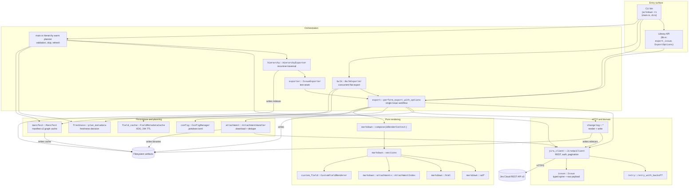
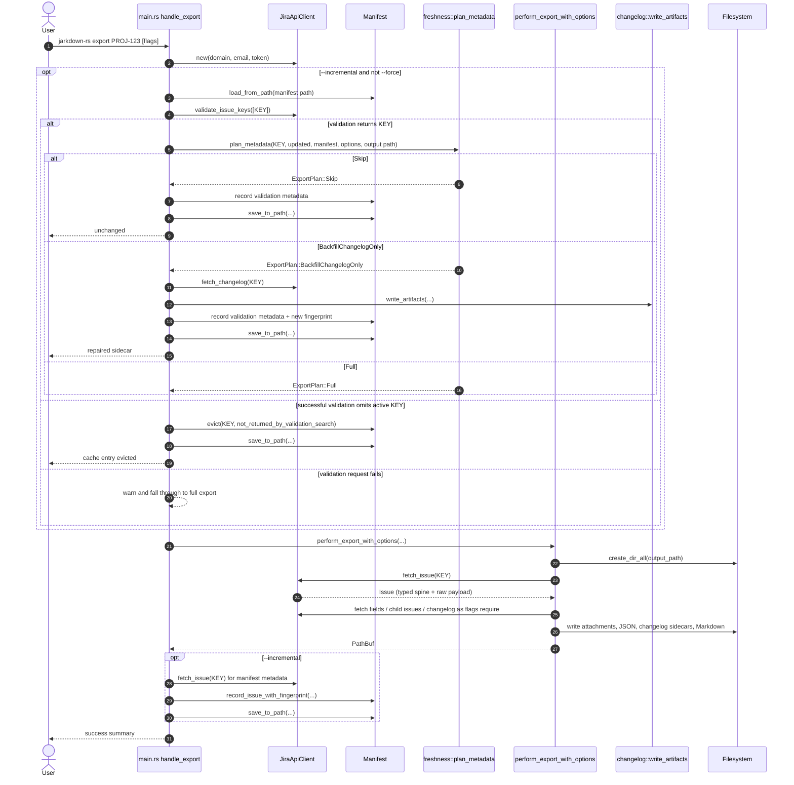
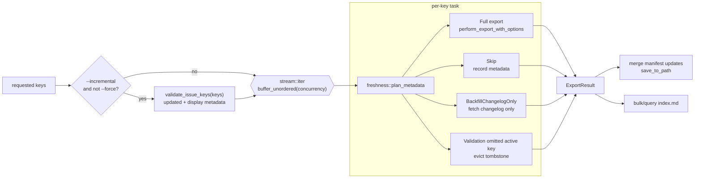
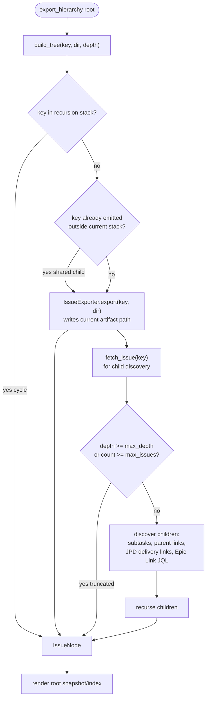
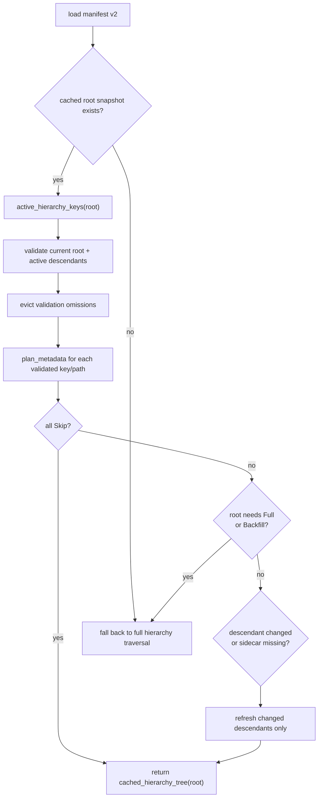
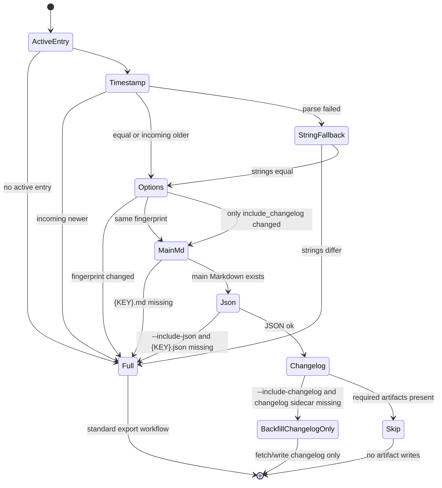
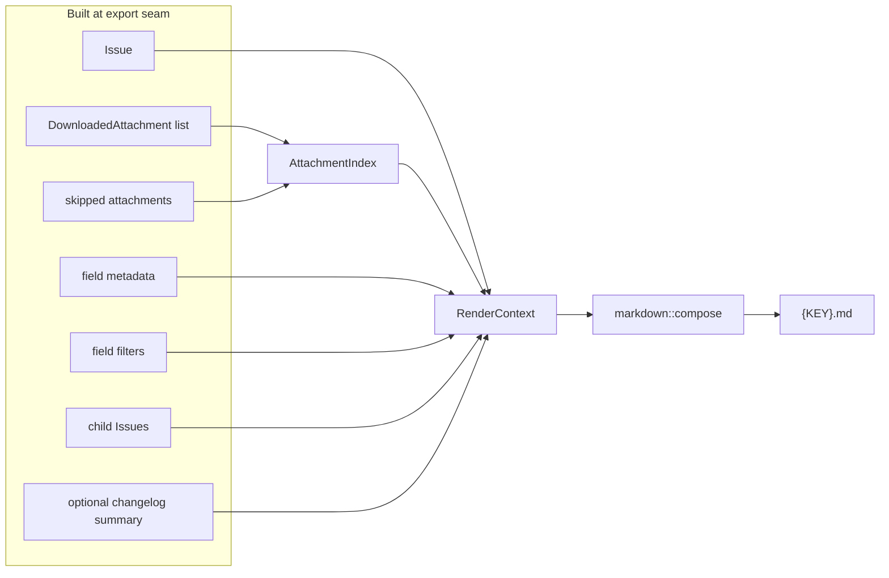
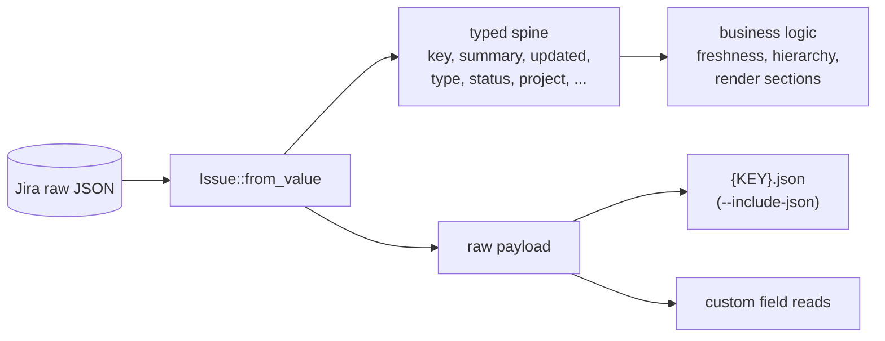
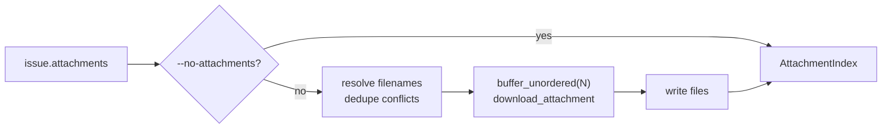

# Architecture

This document describes how jarkdown-rs is layered and how data flows through
the codebase. It complements:

- `CONTEXT.md` — domain glossary.
- `docs/manifest-v2.md` — manifest v2 cache format and diagnostics.
- `docs/adr/0001-changelog-export.md` — why changelog artifacts are siblings
  with one-time incremental backfill semantics.
- `docs/adr/0002-typed-issue-model-retains-raw-payload.md` — why `Issue` keeps
  both typed fields and the raw Jira payload.
- `docs/adr/0003-incremental-validation-uses-manifest-metadata.md` — why warm
  incremental paths use validation metadata instead of full Issue fetches.
- `docs/adr/0004-child-aware-incremental-manifest.md` — why hierarchy cache
  state is graph-backed.

All diagrams are MermaidJS and render natively on GitHub and most modern
Markdown viewers.

## Overall Architecture

The CLI is a thin shell over the reusable library surface. Network transport,
domain parsing, rendering, cache planning, and filesystem writes stay separated
so tests can exercise behavior with local scripted HTTP servers and fake
exporters.

Layer rules to preserve:

- The render layer is pure. `markdown::compose` borrows a `RenderContext`, takes
  no mutable dependencies, performs no I/O, and makes no HTTP calls.
- `jira_client` owns transport and pagination. Typed parsing into `Issue`,
  `ChangelogEntry`, `IssueSearchResult`, and `ValidationIssue` happens at that
  seam.
- Incremental decisions go through `freshness::plan_metadata` or its
  compatibility wrapper `freshness::plan`; callers should not re-derive
  timestamp/artifact/fingerprint rules inline.
- Manifest v2 is the source of cache truth for incremental state, hierarchy
  edges, requested roots, artifact paths, evictions, and root snapshots.

## Single-Issue Export Flow

`jarkdown-rs export PROJ-123` has two phases when `--incremental` is enabled:
cheap validation/planning first, then full export only when required. The
library entry point `export_issue` runs the full export workflow directly
because it does not expose every CLI cache-planning flag.

## Bulk and Query Export

Bulk and query flat exports use one validation pass per invocation when
`--incremental` is enabled and `--force` is not set. Each requested key then
plans independently against the shared validation map.

Per-task full export still uses the same attachment concurrency and timeout
rules as non-incremental export. `query --keys-only` stops after printing keys;
it does not write artifacts or manifests.

## Hierarchy Export and Layouts

`--hierarchy` builds an `IssueNode` tree. The production `IssueExporter`
delegates each Issue artifact write to `perform_export_with_options`, while
tests can substitute a fake exporter. Layout determines where artifacts are
written:

- `corpus`: one canonical directory per Issue under the output root, plus a
  `{ROOT}.hierarchy.md` snapshot.
- `nested`: tree-shaped directories for browsing, plus `index.md`.

`--incremental --hierarchy` defaults to `corpus` because it best matches
shared-cache semantics. Non-incremental hierarchy export keeps the legacy nested
default.

The traversal distinguishes recursion-stack cycle prevention from non-cyclic
shared-child revisits. A shared child can be written at multiple nested paths and
recorded under multiple parent edges without duplicating child discovery.

## Child-Aware Incremental Hierarchy

Warm hierarchy planning validates the current Requested Root plus its active
cached descendants. Successful validation omissions evict only the omitted
active keys and continue planning the remaining validated descendants. Failed
validation requests evict nothing.

Changed leaf descendants are re-exported directly. Changed descendants with
active children are refreshed as bounded subtrees. The subtree depth is computed
from the remaining depth below active Requested-Root paths, taking the maximum
remaining depth across paths. In nested layout, refresh writes a changed shared
Issue to every active artifact path recorded for it.

Root snapshots are traversal snapshots, not live views. Descendant-only refresh
does not rebuild unchanged ancestor snapshots.

## Freshness Decision

`freshness::plan_metadata` combines manifest state, parsed Jira timestamps,
artifact presence, and content-visible option fingerprints.

Timestamp parsing accepts RFC3339 and Jira's `%Y-%m-%dT%H:%M:%S%.f%z` shape. An
older parsed validation timestamp warns and does not regress the stored manifest
timestamp.

## Render Pipeline

`markdown::compose` builds Markdown from a borrowed `RenderContext`. All mutable
work (HTTP, field-cache resolution, attachment downloads, changelog fetches) is
complete before the context is constructed.

The render layer never touches `FieldMetadataCache`, HTTP clients, or the
filesystem. Given the same `RenderContext`, it should produce the same bytes.

## Typed Issue + Raw Payload Duality

`JiraApiClient::fetch_issue` parses Jira JSON into a typed `Issue` and keeps the
original `serde_json::Value` in `Issue.raw`.

Wrong types in the narrow stable spine are hard errors. Unknown or changing
custom-field shapes remain in `raw` and are interpreted only by field renderers
that opt into them.

## Attachment Download Pipeline

Filename resolution is synchronous and deterministic; downloads run
concurrently bounded by `--attachment-concurrency`. `--no-attachments` skips
binary downloads while preserving source Jira URLs in rendered Markdown.

## Where to Look in the Source

| Concern | File |
|---|---|
| CLI parsing | `src/cli.rs`, `src/main.rs` |
| Library entry point | `src/lib.rs` |
| Single-export workflow | `src/export.rs` |
| Flat bulk/query orchestration | `src/bulk.rs`, `src/main.rs` |
| Hierarchy traversal | `src/hierarchy.rs`, `src/exporter.rs` |
| Hierarchy warm planning | `src/main.rs` |
| HTTP transport | `src/jira_client.rs`, `src/retry.rs` |
| Typed Issue model | `src/issue.rs` |
| Incremental decision | `src/freshness.rs`, `src/manifest.rs` |
| Manifest v2 cache | `src/manifest.rs`, `docs/manifest-v2.md` |
| Render pipeline | `src/markdown/{mod,sections,adf,html,attachments}.rs` |
| Custom field rendering | `src/custom_field.rs` |
| Changelog rendering | `src/changelog.rs` |
| Field metadata cache | `src/field_cache.rs` |
| User configuration | `src/config.rs` |
| Attachment downloads | `src/attachment.rs` |
| Error type | `src/error.rs` |
